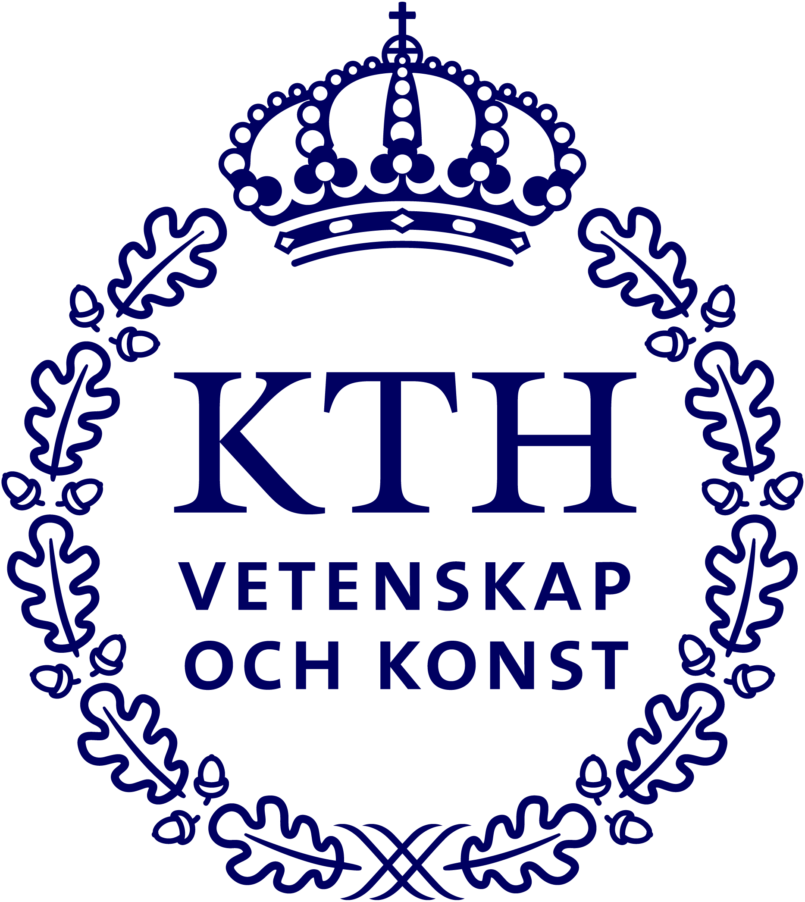
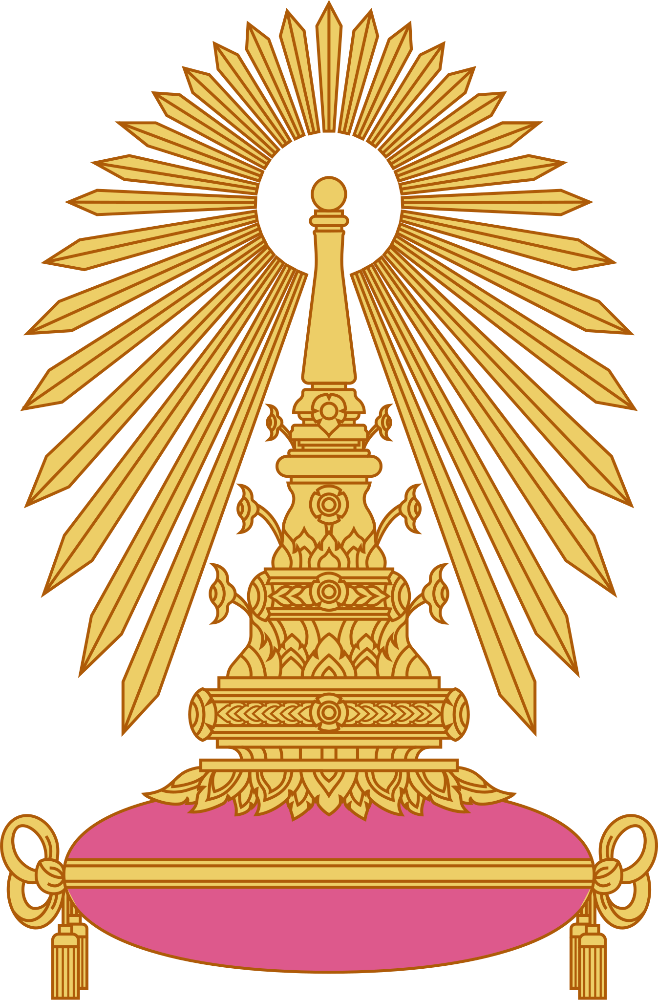

---
# the default layout is 'page'
icon: fas fa-file
order: 1
---

Robotics control engineer with a strong focus on control systems, robotics, and mechanical design. Holds a Master’s degree in Systems, Control, and Robotics from KTH Royal Institute of Technology. Also, a Bachelor’s degree in Mechanical Engineering from Chulalongkorn University. Passionate about developing innovative solutions to address real-world challenges and committed to advancing the field of robotics. 

Here is my <a href="{{ site.baseurl }}/assets/about/cv/CV_Sujet_Phodapol.pdf" style="text-decoration: none; color: black; font-weight: bold;" target="_blank">CV</a>.

{: width="400" height="400" }
_With my robots at KTH Space Robotics Lab, Sweden._

# Education

    
    

        <a href="https://www.kth.se/en" style="text-decoration: none; color: black; font-weight: bold;">KTH Royal Institute of Technology</a>
         
        <strong>Master of Science (M.Sc.)</strong> – <em>Systems, Control, and Robotics</em>
          
        Sep 2021 - Nov 2023, Stockholm, Sweden
        <ul style="margin-left: 1em; list-style-type: disc;">
            <li>Grade: 5.0/5.0</li>
            <li><strong>Master's Thesis:</strong> "<a href="{{ site.baseurl }}/assets/about/thesis/Master_thesis_2023.pdf" style="text-decoration: none; color: black; font-style: italic;">Predictive controllers for load transportation in microgravity environments</a>"
             Supervised by Pedro Roque and Prof. Dimos V. Dimarogonas.</li>
        </ul>
    

    
    

        <a href="https://ethz.ch/en.html" style="text-decoration: none; color: black; font-weight: bold;">ETH Zürich</a>
          <strong>Master of Science (Exchange)</strong> – <em>Robotics, Systems and Control</em>  
         
        Sep 2022 - Feb 2023, Zürich, Switzerland
        <ul style="margin-left: 1em; list-style-type: disc;">
            <li><strong>Semester thesis:</strong> "<a href="{{ site.baseurl }}/assets/about/thesis/Semester_thesis_IFA_2023.pdf" style="text-decoration: none; color: black; font-style: italic;">Data‑driven adaptive control: a geometric approach</a>" at <a href="https://control.ee.ethz.ch" style="text-decoration: none; color: black;">Automatic Control Laboratory</a>,
              Supervised by Alberto Padoan and Jeremy Coulson.</li>
            <li><strong>Semester thesis:</strong> "<a href="{{ site.baseurl }}/assets/about/thesis/Semester_thesis_RSL_2023.pdf" style="text-decoration: none; color: black; font-style: italic;">Design Optimization for Serial Elastic Actuators on Quadrupedal Robots</a>" at <a href="https://rsl.ethz.ch" style="text-decoration: none; color: black;">Robotic Systems Lab</a>
             Supervised by Fabian Tischhauser and Filip Bjelonic.</li>
        </ul>
    

    
    

        <a href="https://www.chula.ac.th/en/" style="text-decoration: none; color: black; font-weight: bold;">Chulalongkorn University</a>
          <strong>Bachelor of Engineering (B.E.)</strong> – <em>Mechanical Engineering</em>  
         
        Aug 2016 - May 2020, Bangkok, Thailand
        <ul style="margin-left: 1em; list-style-type: disc;">
            <li>Grade: 3.96/4.00, First-Class Honors, Gold Medal </li>
            <li><strong>Senior project:</strong> "<a href="{{ site.baseurl }}/assets/about/thesis/Bachelor_thesis_2020.pdf" style="text-decoration: none; color: black; font-style: italic;">An Agile Quadruped Robot</a>"
             Supervised by Prof. Viboon Sangveraphunsiri.</li>            
        </ul>
    

