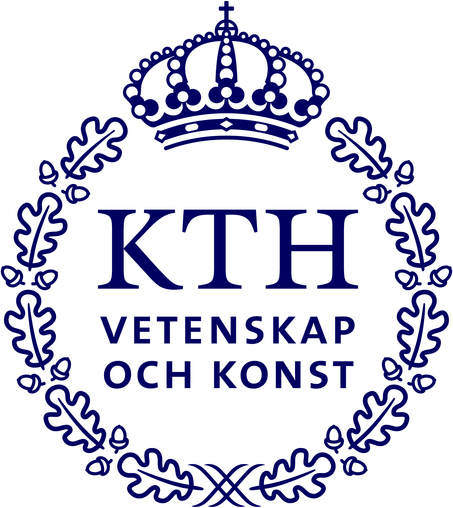

---
# the default layout is 'page'
icon: fas fa-file
order: 1
---

Robotics control engineer with a strong focus on control systems, robotics, and mechanical design. Holds a Master’s degree in Systems, Control, and Robotics from KTH Royal Institute of Technology. Passionate about developing innovative solutions to address real-world challenges and committed to advancing the field of robotics.

# Education

    
    

        <a href="https://www.kth.se/en" style="text-decoration: none; color: black; font-weight: bold;">KTH Royal Institute of Technology</a>
         
        <strong>Master of Science (M.Sc.)</strong> – <em>Systems, Control, and Robotics</em>
          
        Sep 2021 - Nov 2023, Stockholm, Sweden
        <ul style="margin-left: 1em; list-style-type: disc;">
            <li>Grade: 5.0/5.0</li>
            <li><strong>Master's Thesis:</strong> <em>Distributed Predictive Controllers for Load Transportation in Microgravity Environments</em>, supervised by Pedro Roque and Prof. Dimos V. Dimarogonas.</li>
        </ul>
    

    
    

        <a href="https://ethz.ch/en.html" style="text-decoration: none; color: black; font-weight: bold;">ETH Zürich</a>
          <strong>Master of Science (Exchange)</strong> – <em>Robotics, Systems and Control</em>  
         
        Sep 2022 - Feb 2023, Zürich, Switzerland
        <ul style="margin-left: 1em; list-style-type: disc;">
            <li><strong>Semester project:</strong> <em>Data‑driven adaptive control: a geometric approach</em> at Automatic Control Laboratory, supervised by Alberto Padoan and Jeremy Coulson.</li>
            <li><strong>Semester thesis:</strong> <em>Design Optimization for Serial Elastic Actuators on Quadrupedal Robots</em> at Robotic Systems Lab, supervised by Fabian Tischhauser and Filip Bjelonic.</li>
        </ul>
    

    
    

        <a href="https://ethz.ch/en.html" style="text-decoration: none; color: black; font-weight: bold;">Chulalongkorn University</a>
          <strong>Bachelor of Engineering (B.E.)</strong> – <em>Mechanical Engineering</em>  
         
        Sep 2022 - Feb 2023, Bangkok, Thailand
        <ul style="margin-left: 1em; list-style-type: disc;">
            <li>Grade: 3.96/4.00, First-Class Honors, Gold Medal </li>
            <li><strong>Senior project:</strong> <em>An Agile Quadruped Robot </em>, supervised by Prof. Viboon Sangveraphunsiri.</li>            
        </ul>
    

